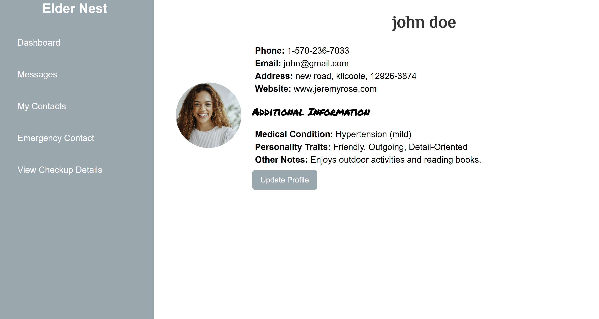

# Elder-Nest 🎯

## Basic Details
### Team Name: Tech Mania

### Team Members
- Member 1: Alka Devi - LBS Institute of Technology for Women
- Member 2: Aditi B S - LBS Institute of Technology for Women
- Member 3: Asamsa B M - LBS Institute of Technology for Women

### Hosted Project Link
https://elderly-assistance-nbnp.vercel.app/

### Project Description
This app connects elderly residents in Kerala with essential services like food delivery, medicine delivery, and transportation assistance, while creating part-time job opportunities for local youth, including college students. By providing a simple, accessible platform, it bridges the gap between seniors' needs and the community's workforce, improving both quality of life and economic opportunities

### The Problem statement
We’re solving the problem of elderly residents in Kerala being stranded without basic services like food delivery, medicine, and transportation, while young adults and college students struggle to find part-time jobs. The ridiculousness lies in the fact that two groups—vulnerable seniors and unemployed youth—are disconnected, when they could be seamlessly helping each other through a simple, community-driven app. It’s a win-win that turns isolation and unemployment into opportunity and care.

### The Solution
We’re creating a super-simple, all-in-one mobile app that connects elderly residents with the services they need while giving local youth a chance to earn and make a difference. It’s like matchmaking—but for food delivery, medicine, and transportation! Seniors can easily order meals, medicine, or book a ride, and college students can sign up to be their go-to helpers. No more missed meals or forgotten meds, and no more long job hunts for college students. The app is their one-stop-shop for care, convenience, and community! Plus, it’s designed to be so easy that even tech-shy seniors can use it with ease. Everyone wins! 🙌

## Technical Details
### Technologies/Components Used
For Software:
- HTML,CSS
- Fakestore API
- bcrypt, fetchAPI

### Implementation
For Software:
# Installation
[commands]

# Run
[commands]

### Project Documentation
For Software:

# Screenshots (Add at least 3)
 - This is the page which contains the user profile. Once the user is 
logged in he/she will be able to access details and update, such as emergency contact, and medical checkup details.

![Screenshot2]
*This page handles the medicine purchase and cart management.

![Screenshot3]
this page manages payment information like cardholder name, number, expiry date, and cvv

# Diagrams
![Workflow]
This workflow illustrates the step-by-step process a user follows in the Elderly Assistance App, starting from logging in to viewing the dashboard. It begins with a simple login procedure, followed by access to the user's profile where they can view and update their details. The user can then proceed to purchase medicines by searching, selecting, and adding items to the cart. After reviewing the cart, the payment process is initiated, and once successful, the user receives an order confirmation and is redirected to the dashboard. The dashboard serves as a central hub, where users can track active orders, receive health reminders, and access their profile for any updates. This streamlined workflow ensures easy navigation and accessibility, tailored to the needs of elderly users.

For Hardware:

# Schematic & Circuit

*Add caption explaining connections*

*Add caption explaining the schematic*

# Build Photos

*List out all components shown*

*Explain the build steps*

*Explain the final build*

### Project Demo
# Video
https://vimeo.com/1052686079/4bfd70b180?share=copy
In the video, we demonstrated the functionality of the Elderly Assistance Web App. It showcases how a user can smoothly navigate through the app, starting from the login screen, where they authenticate their access. Once logged in, the user can view and update their profile, ensuring their information is up-to-date.

The video also highlights how users can browse available medicines, select items to add to their cart, and proceed with the payment process securely. After completing the payment, the app confirms the order and directs users to the dashboard, which acts as a central hub for tracking ongoing orders, managing reminders, and accessing their personalized services.

Overall, the demo emphasizes the app’s ease of use, ensuring elderly users can complete essential tasks like purchasing medicines and managing their health-related needs with minimal effort and maximum convenience.

# Additional Demos
[Add any extra demo materials/links]

## Team Contributions
- Alka Devi : idea, development
- Asamsa B M: idea, development
- Aditi B S: idea, development

---
Made with ❤️ at TinkerHub
